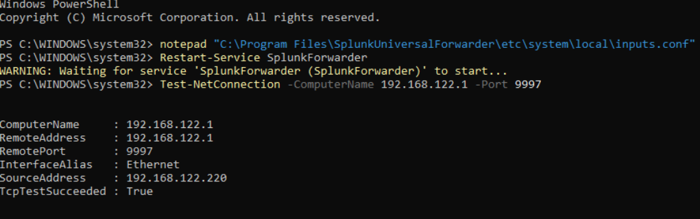
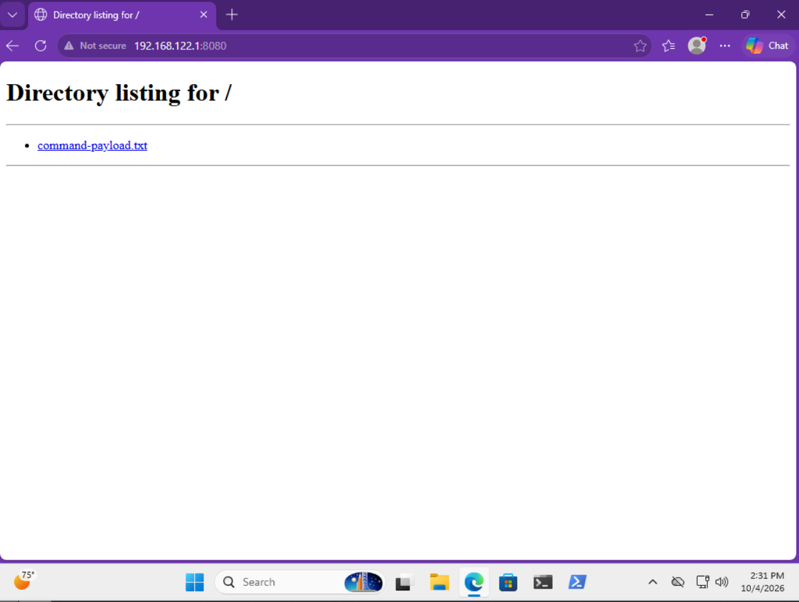
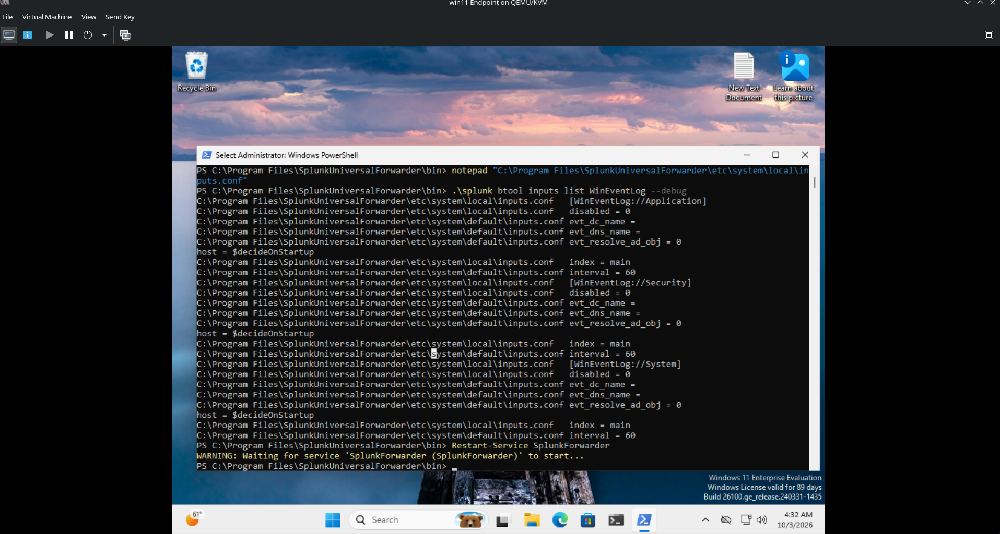
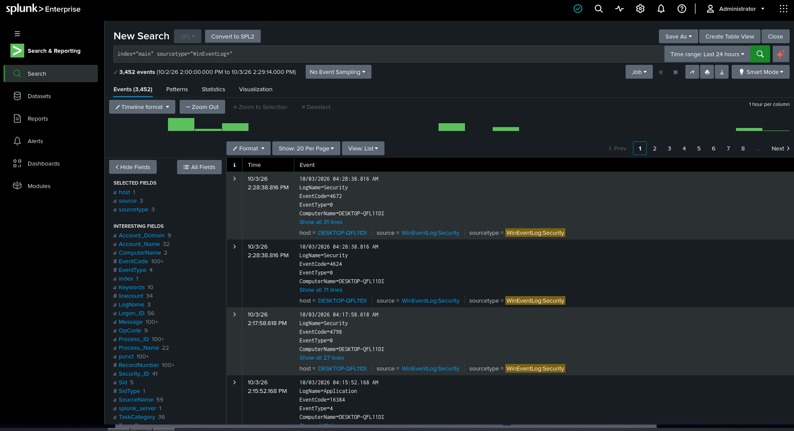
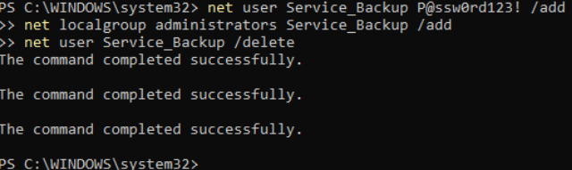
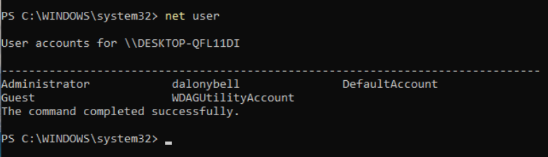
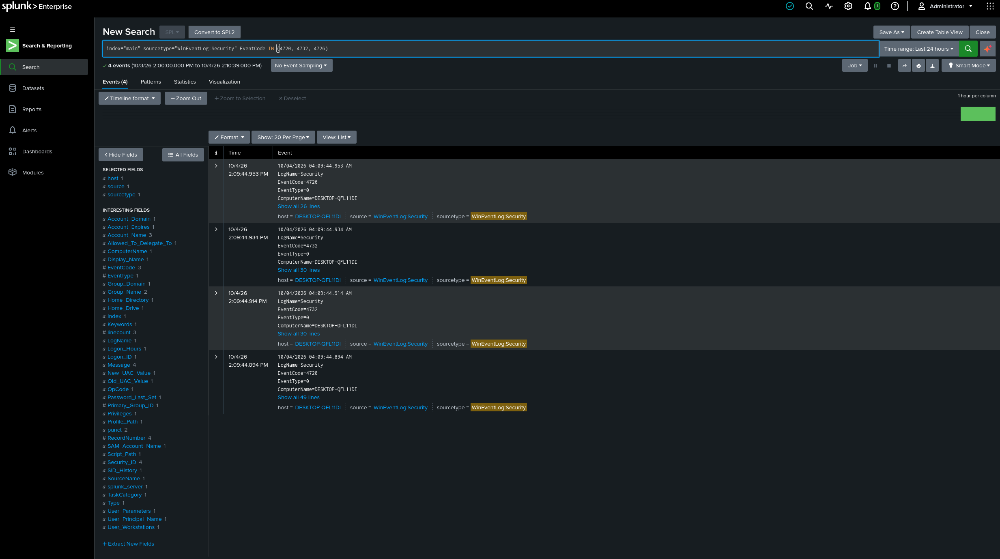

# Splunk Windows Event Log Analysis Lab

A comprehensive Splunk project for capturing, analyzing, and correlating Windows Event Logs from a Windows 11 endpoint to detect suspicious activities, privilege escalation attempts, and advanced attack techniques in a lab environment.

## Table of Contents

- [Overview](#overview)
- [Architecture](#architecture)
- [Data Sources & Ingestion](#data-sources--ingestion)
- [Suspicious Activity Scenarios](#suspicious-activity-scenarios)
- [Dashboards](#dashboards)
- [Usage Examples](#usage-examples)
- [Setup Instructions](#setup-instructions)
- [Operational Notes](#operational-notes)

---

## Overview

This lab project demonstrates how to use Splunk to monitor and detect advanced threats on a Windows 11 endpoint, including:

- Privilege Escalation Detection: Identifying attempts to gain administrative access through suspicious account creation and group membership changes
- Lateral Movement & Tool Transfer: Detecting ingress of malicious tools and payloads from external sources
- Living-off-the-Land Attacks: Correlating Windows Event Log sequences to identify rapid account lifecycle events that indicate automated attacks
- Event Correlation: Using Splunk to tie together multiple event sources that individually appear benign but collectively indicate malicious activity

### Key Use Cases

- Security Operations Center (SOC) training and incident response simulation
- Threat hunting and adversary emulation
- MITRE ATT&CK framework mapping and validation
- Windows security log analysis and correlation techniques

---

## Architecture

```text
┌─────────────────────────────────────────────────────────────┐
│                    Lab Environment                          │
├─────────────────────────────────────────────────────────────┤
│                                                              │
│  ┌──────────────────────┐          ┌────────────────────┐  │
│  │  Windows 11 VM       │          │    Linux Host      │  │
│  │  ─────────────────   │          │  ───────────────── │  │
│  │  • WinEventLog       │          │  • Splunk Enterprise│  │
│  │  • Event IDs: 4720,  │  TCP/9997│  • Forwarder Listen│  │
│  │    4732, 4726, etc.  │  network │  • Python HTTP Srv │  │
│  │  • Universal         ├──────────┤  • Port 8080 (Web) │  │
│  │    Forwarder Enabled │          │  • Port 9997 (Data)│  │
│  │                      │          │                    │  │
│  └──────────────────────┘          └────────────────────┘  │
│           │                                   ▲             │
│           │ WinEventLog (System, Security)    │             │
│           │ Simulated Attacks & Scenarios     │             │
│           └───────────────────────────────────┘             │
│                                                              │
└─────────────────────────────────────────────────────────────┘
```

Data flow:
1. Windows 11 endpoint generates security events (WinEventLog)
2. Splunk Universal Forwarder captures and forwards events
3. Events traverse the libvirt network bridge to Linux host
4. Splunk Enterprise indexes and correlates events in real time
5. Dashboards and searches provide visibility and alerting



---

## Data Sources & Ingestion

### Windows Event Log Sources

The project monitors the following Windows Security Event Log categories:

| Event ID | Description | Use Case |
|----------|-------------|----------|
| 4720 | A user account was created | Detect unauthorized account creation |
| 4732 | A member was added to a security-enabled local group | Track group membership changes |
| 4726 | A user account was deleted | Identify cleanup attempts after compromise |
| 4624 | An account was successfully logged on | Track user access patterns |
| 4625 | An account failed to log on | Detect brute force attempts |
| 4688 | A new process has been created | Monitor process execution |
| 4689 | A process has exited | Track process lifecycle |
| 5156 | Windows Filtering Platform allowed a connection | Monitor network activity |

### Splunk Universal Forwarder Configuration

inputs.conf (strict UTF-8 encoding, no BOM):

```ini
[WinEventLog://Security]
index = main
sourcetype = WinEventLog:Security
disabled = false

[WinEventLog://System]
index = main
sourcetype = WinEventLog:System
disabled = false

[WinEventLog://Application]
index = main
sourcetype = WinEventLog:Application
disabled = false
```

outputs.conf:

```ini
[tcpout]
defaultGroup = splunk_indexer
forwardedindex.filter.disable = true
indexAndForward = false

[tcpout:splunk_indexer]
server = <linux-host-ip>:9997
clientCert = $SPLUNK_HOME/etc/auth/mycerts/client.pem
sslVerifyServerCert = false
```

---

## Suspicious Activity Scenarios

### 1. Ingress Tool Transfer (MITRE ATT&CK T1105)

Objective: Simulate the delivery of an encoded PowerShell payload from an external Linux host to bypass network isolation controls.

Attack flow:

1. Python HTTP server on the Linux host serves an encoded PowerShell command (`command-payload.txt`)
2. The Windows endpoint retrieves the payload over HTTP
3. The encoded command executes locally to simulate malicious tooling being delivered to the endpoint in a lab environment

Example setup on the Linux host:

```bash
# Stage the encoded PowerShell command
echo "powershell.exe -ExecutionPolicy Bypass -WindowStyle Hidden -EncodedCommand VwByAGkAdABlAC0ASABvAHMAdAAgACIASABlAGwAbABvACAAUwBwAGwAdQBuAGsAIQAiAA==" > command-payload.txt

# Start temporary HTTP server
python3 -m http.server 8080
```



Example execution on the Windows endpoint:

```powershell
# Execute the retrieved encoded command
powershell.exe -ExecutionPolicy Bypass -WindowStyle Hidden -EncodedCommand VwByAGkAdABlAC0ASABvAHMAdAAgACIASABlAGwAbABvACAAUwBwAGwAdQBuAGsAIQAiAA==
```



Splunk detection example:

```spl
sourcetype=WinEventLog:Security EventCode=5156
| search dest_port=8080 dest_ip="<linux-ip>"
| stats count by user, dest_ip, dest_port, action
```



This technique demonstrates how an attacker can use a temporary Python HTTP server to serve an encoded payload and bypass clipboard/network isolation controls in a lab scenario.

---

### 2. Phantom Privilege Escalation

Objective: Simulate living-off-the-land techniques by creating a fake admin-like account, adding it to the local Administrators group, and deleting it rapidly before it is noticed.

Attack flow:

1. Create a fake account named `Service_Backup`
2. Add it to the local Administrators group
3. Delete the account quickly to wipe traces from the Windows endpoint

PowerShell commands:

```powershell
# Create the fake service account
net user Service_Backup P@ssw0rd123! /add

# Add it to the local Administrators group
net localgroup Administrators Service_Backup /add

# Delete it rapidly
net user Service_Backup /delete
```



The account is effectively invisible on the Windows endpoint after deletion (`net user` shows nothing), but Splunk can still correlate the events:

- Event ID 4720: A user account was created
- Event ID 4732: A user was added to a security-enabled local group
- Event ID 4726: A user account was deleted



Splunk correlation example:

```spl
sourcetype=WinEventLog:Security (EventCode=4720 OR EventCode=4732 OR EventCode=4726)
| transaction user_account startswith=(EventCode=4720) endswith=(EventCode=4726) maxspan=5m
| search EventCode=4732
| table user_account, EventCode, timestamp, ComputerName
| stats count by user_account
| where count >= 3
```



This demonstrates a phantom privilege escalation sequence: temporary local administrator creation, permission assignment, and rapid cleanup that is visible in Splunk but not on the endpoint after the account is deleted.

---

## Dashboards

### Dashboard 1: Privilege Escalation Detection

Purpose: Real-time monitoring of account creation and group membership changes.

Panels:
- New Accounts Created (Event ID 4720)
- Admin Group Changes (Event ID 4732)
- Account Deletions (Event ID 4726)
- Correlated rapid changes within 5 minutes

Search:

```spl
sourcetype=WinEventLog:Security (EventCode=4720 OR EventCode=4732 OR EventCode=4726)
| timechart count by EventCode
```

### Dashboard 2: Process Execution & Lateral Movement

Purpose: Monitor suspicious process creation and network connections.

Panels:
- PowerShell execution
- Outbound connections to unusual ports
- Tool transfer attempts
- Failed process execution

Search:

```spl
sourcetype=WinEventLog:Security EventCode=5156 action=allow
| search dest_port=8080 OR dest_port=3389
| stats count, values(dest_ip), values(dest_port) by user
```

### Dashboard 3: Security Event Summary

Purpose: High-level overview of all security events.

Panels:
- Event count by type
- Top users by event count
- Failed logins
- Account lifecycle events

---

## Usage Examples

### Example 1: Find all failed login attempts in the last 24 hours

```spl
sourcetype=WinEventLog:Security EventCode=4625
| stats count as failed_attempts by user, dest_ip
| sort - failed_attempts
| head 20
```

### Example 2: Detect rapid account creation and deletion

```spl
sourcetype=WinEventLog:Security (EventCode=4720 OR EventCode=4726)
| transaction user_account startswith=(EventCode=4720) endswith=(EventCode=4726) maxspan=10m
| search EventCode=4720 AND EventCode=4726
| table user_account, ComputerName, timestamp
```

### Example 3: Track Administrators group membership changes

```spl
sourcetype=WinEventLog:Security EventCode=4732 group="Administrators"
| table timestamp, user_account, action, ComputerName
| stats count by user_account, action
```

### Example 4: Monitor PowerShell execution attempts

```spl
sourcetype=WinEventLog:Security EventCode=4688 process_name=powershell.exe
| stats count as execution_count by user, process_name, ComputerName
| where execution_count > 5
```

### Example 5: Correlate multi-stage attack sequence

```spl
sourcetype=WinEventLog:Security
| search (EventCode=5156 AND dest_port=8080) OR (EventCode=4720) OR (EventCode=4732 AND group="Administrators")
| stats count by EventCode, user
| timechart count by EventCode
```

---

## Setup Instructions

### Prerequisites

- Windows 11 VM with network access to Splunk host
- Linux host with Splunk Enterprise installed
- libvirt network bridge configured between VMs
- Splunk Universal Forwarder installed on Windows 11

### Step 1: Install Splunk Universal Forwarder on Windows 11

1. Download the Universal Forwarder
2. Run the installer
3. Complete the installation path

### Step 2: Enable Process Tracking & Command-Line Auditing

Event ID 4688 and command-line logging are **disabled by default** on Windows 11 and must be explicitly enabled before any process-execution telemetry will appear in Splunk.

1. Open `gpedit.msc`
2. Navigate to `Computer Configuration > Windows Settings > Security Settings > Advanced Audit Policy Configuration > Audit Policies > Detailed Tracking`
3. Set **Audit process tracking** to **Success**
4. Navigate to `Computer Configuration > Administrative Templates > System > Audit Process Creation`
5. Set **Include command line in process creation events** to **Enabled**
6. Run `gpupdate /force` to apply the policy

### Step 3: Configure inputs.conf

Use UTF-8 encoding without BOM when editing configuration files. Avoid Notepad because it can inject a hidden UTF-8 BOM.

```ini
[WinEventLog://Security]
index = main
sourcetype = WinEventLog:Security
disabled = false

[WinEventLog://System]
index = main
sourcetype = WinEventLog:System
disabled = false
```

### Step 4: Configure outputs.conf

```ini
[tcpout]
defaultGroup = splunk_indexer

[tcpout:splunk_indexer]
server = <linux-host-ip>:9997
```

### Step 5: Restart Splunk Forwarder

```powershell
Restart-Service SplunkForwarder
```

### Step 6: Verify on Splunk Enterprise

1. Log in to Splunk Web
2. Search for Windows event data
3. Confirm data source appears in the index

---

## Operational Notes

### Architecture Decisions

- Focus on account lifecycle (4720, 4726, 4732) and process execution (4688)
- Use `main` index for simplicity in a lab environment
- Keep event collection minimal to reduce Windows endpoint overhead

### Performance Considerations

- Windows 11 can generate a moderate volume of log events during normal use
- Correlation searches should use narrow time windows when testing attack scenarios
- For production use, separate event types and retention policies by purpose

### Engineering Challenges & Troubleshooting

#### Network Bridging

The lab initially failed because the Linux libvirt firewall zone was dropping traffic from the Windows VM. The fix was to manually allow TCP/9997 (Splunk forwarding) and TCP/8080 (Python HTTP payload server) traffic so the forwarder and the tool-transfer scenario could reach the Linux host.

Example firewall allow rule:

```bash
sudo firewall-cmd --zone=libvirt --add-port=9997/tcp --permanent
sudo firewall-cmd --zone=libvirt --add-port=8080/tcp --permanent
sudo firewall-cmd --reload
```

This resolved the connectivity issue and allowed WinEventLog data and payload traffic to reach the Splunk indexer and HTTP server respectively.

#### Configuration Encoding

A silent failure occurred because Windows Notepad injected a hidden UTF-8 BOM into `inputs.conf`. The Splunk forwarder could not read the configuration file correctly, and the issue was diagnosed using Splunk `btool` from the CLI.

Diagnostic command:

```cmd
C:\Program Files\SplunkUniversalForwarder\bin\splunk show config inputs
```

The fix was to recreate the config file with strict UTF-8 encoding and no BOM. This restored the forwarder's ability to ingest Windows event logs properly.

---

## Conclusion

This lab demonstrates how to use Splunk to capture and correlate Windows Event Log data for threat detection. By monitoring local account changes, process execution, and network connections, security analysts can identify suspicious activity patterns and validate attack scenarios in a controlled environment.

---

## References

- MITRE ATT&CK framework
- Windows Security Event Log reference
- Splunk Universal Forwarder documentation
- Splunk Search and Reporting reference
